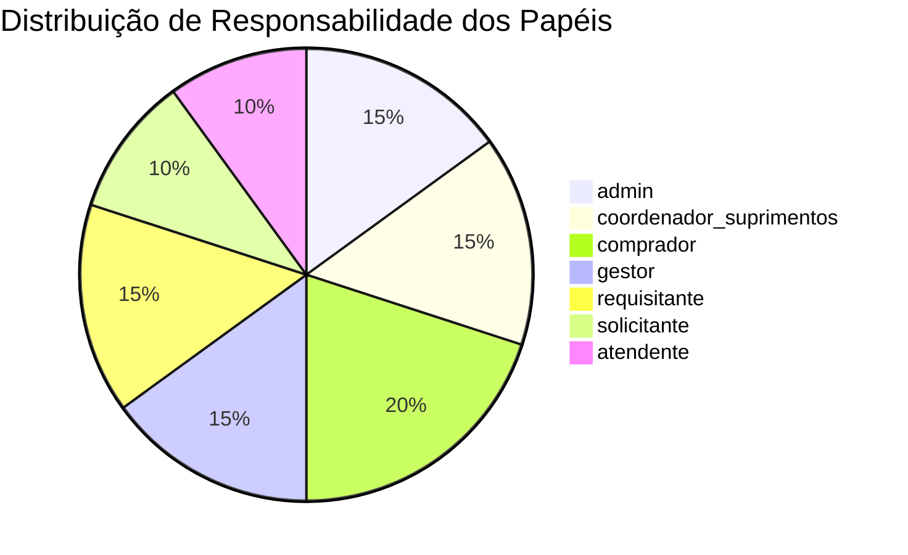
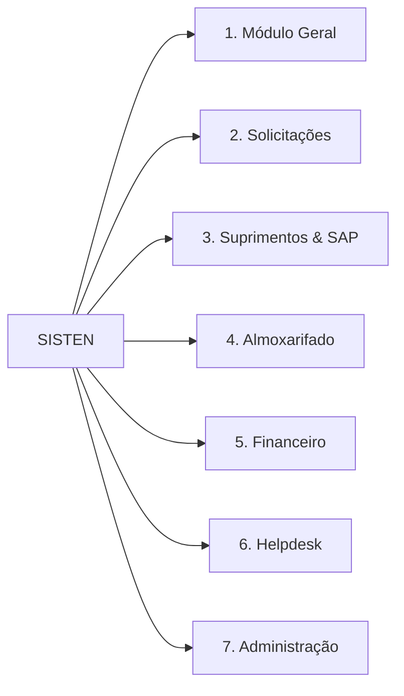
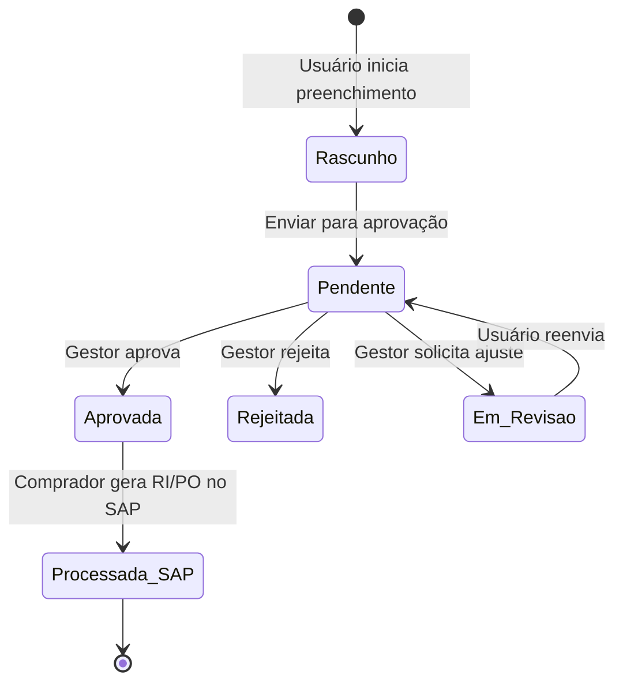
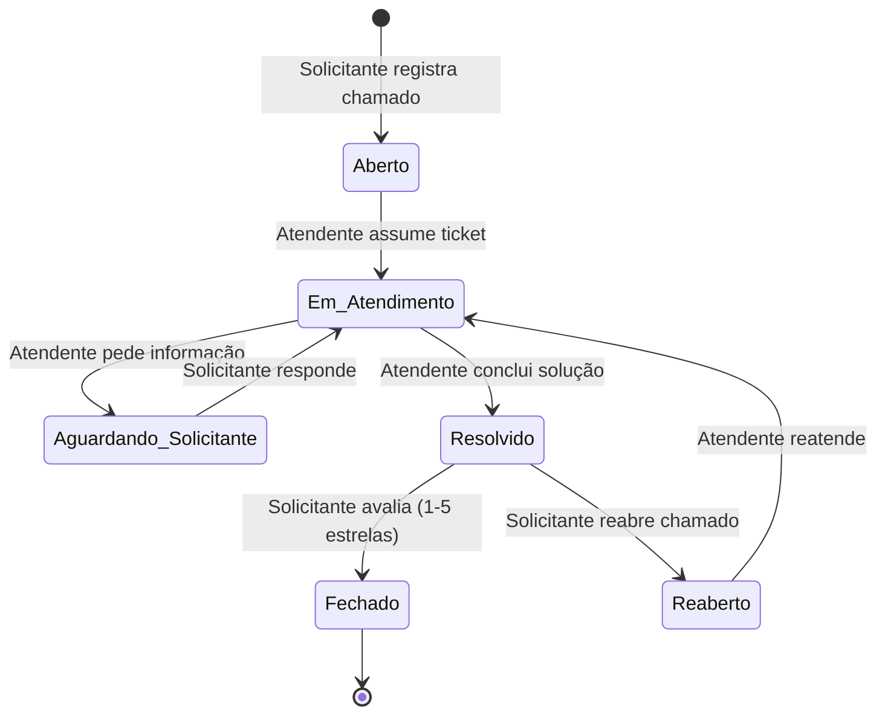

# PRD — Documento de Requisitos do Produto: SISTEN

> **Sistema de Informação TEN (SISTEN)**  
> **Empresa:** Torres Eólicas do Nordeste S.A. (TEN) — Jacobina/BA  
> **Versão:** 1.0.0  
> **Status:** Em Produção  
> **Última Atualização:** Agosto / 2026  

---

## 1. Visão Geral e Objetivos do Produto

O **SISTEN** (Sistema de Informação TEN) é a plataforma web unificada da **Torres Eólicas do Nordeste S.A.** destinada à gestão integrada da cadeia de suprimentos, solicitações corporativas, catálogo de materiais, controle contratual, contas a pagar, almoxarifado e chamados de helpdesk (incluindo jurídico e suporte operacional).

### 1.1 Objetivos Estratégicos
* **Centralização de Demandas:** Eliminar o uso de planilhas paralelas e e-mails para solicitações de compras, cadastros no SAP e chamados de suporte.
* **Visibilidade e Rastreabilidade Total:** Permitir que solicitantes, gestores e compradores acompanhem em tempo real o ciclo de vida de cada requisição (desde o rascunho até a entrega física e faturamento).
* **Integração com SAP ERP:** Sincronizar dados das transações SAP (`ME5A`, `ZL0132`, `ME3N`, `ME3M`, `ZL0024`, `FBL1N`), enriquecendo-os com lead times, indicadores operacionais e faróis de atraso.
* **Auditoria de Preços com IPCA:** Comparar compras atuais (2026) contra o histórico corrigido pela inflação oficial (IPCA), identificando distorções de preços, ganhos de escala ou anomalias.
* **Operação Resiliente Offline/Online:** Fornecer navegação instantânea via cache local em IndexedDB com sincronização incremental em segundo plano via Supabase.

---

## 2. Arquitetura Técnica e Stack de Tecnologia

```mermaid
graph TD
    Client[Navegador Client-Side] --> App[React 19 + TypeScript + Tailwind CSS 4]
    App --> Router[Roteador Baseado em Hash window.location.hash]
    App --> LocalDB[Camada localDb / idb-keyval Cache IndexedDB]
    LocalDB <--> Sync[Sincronizador Incremental em Segundo Plano]
    Sync <--> SupabaseSDK[@supabase/supabase-js v2]
    SupabaseSDK <--> SupabaseDB[(Supabase Postgres 17)]
    SupabaseSDK <--> Storage[Supabase Storage Buckets]
    SupabaseSDK <--> EdgeFuncs[Supabase Edge Functions Deno]
```

### 2.1 Especificação da Stack

| Camada | Tecnologia | Função no Sistema |
| :--- | :--- | :--- |
| **Frontend Framework** | React 19.0.1 + TypeScript 5.8 | Interface declarativa reativa e tipagem estática ponta a ponta |
| **Estilização & UI** | Tailwind CSS 4.1, Lucide React, Motion 12 | Design System moderno, ícones e animações fluidas |
| **Data Viz & Grafos** | Recharts 3.9 | Dashboards interativos de suprimentos, almoxarifado e financeiro |
| **Manipulação de Dados**| `xlsx` (SheetJS), `pdf-lib`, `date-fns` | Exportação/leitura de planilhas Excel, geração de PDFs e manipulação de datas |
| **Build & Tooling** | Vite 6.2 + Vitest 3.2 | Bundler de altíssimo desempenho e suíte de testes unitários/integração |
| **Backend / DB** | Supabase (Postgres 17, Auth, Storage, Edge Functions) | Banco relacional, autenticação JWT, armazenamento de anexos e funções serverless em Deno |
| **Persistência Local** | IndexedDB via `idb-keyval` 6.2 | Cache offline de alta velocidade e preservação de estado da aplicação |

---

## 3. Matriz de Perfis, Acessos e Permissões (RBAC)

O SISTEN adota um modelo híbrido de Controle de Acesso Baseado em Papéis (RBAC) combinado com overrides granulares por usuário (`page_access`), restrições de setor (`aprovador_setores`) e atribuição de grupos de comprador SAP (`grupo_compras`).

### 3.1 Papéis do Sistema (`Role`)



1. **`admin`**: Acesso irrestrito a todos os módulos, configurações globais, permissões, importação SAP, auditoria de uso e modo de simulação de papéis.
2. **`coordenador_suprimentos`**: Gestão da equipe de compras, atesto de cadastros SAP, atribuição de grupo comprador, aprovação de todas as solicitações e visibilidade dos dashboards executivos.
3. **`comprador`**: Operação da Central de Compras (sem PO), inclusão de observações/status em RIs/RMs, interação no Rastreio de Compras e estimador de frete.
4. **`gestor`**: Aprovação técnica e financeira de solicitações de compra enviadas pelos setores sob sua alçada (`aprovador_setores`).
5. **`requisitante`**: Acesso à fila coletiva de solicitações (`/solicitacoes/todas`), visualização e resposta de chamados de múltiplos setores.
6. **`solicitante`**: Usuário padrão de ponta. Pode criar solicitações de compra, solicitar cadastros no SAP, abrir chamados no Helpdesk e acompanhar a aba "Minhas Solicitações".
7. **`atendente`**: Operador especializado de chamados de Helpdesk/suporte (TI, RH, Jurídico, Serviços).
8. **`visualizador`**: Perfil de consulta somente-leitura a relatórios e catálogos.
9. **`pendente`**: Usuário recém-cadastrado aguardando homologação e liberação pelo administrador.

### 3.2 Regras Especiais e Feature Flags Dinâmicas
* **Simulação de Perfil (Admin Only):** Administradores podem alternar temporariamente para visualizar o sistema sob a ótica de qualquer papel (salvo em `sessionStorage`).
* **Matriz de Aprovação de Setor (`aprovador_setores`):** Permite declarar explicitamente quais setores um gestor tem autoridade para aprovar.
* **Aprovador de Cadastro SAP (`aprovador_cadastro_sap`):** Define usuários específicos para receber alertas de novos materiais/fornecedores a cadastrar no SAP.
* **Feature Flag `rastreio_valores`:** Controla a exibição dos montantes financeiros (R$) na tela de Rastreio de Compras para perfis operacionais.
* **Feature Flag `juridico_notificar`:** Direciona notificações de novos chamados com escopo jurídico para usuários do time jurídico.

---

## 4. Estrutura do Projeto e Organização de Código

```
sisten/
├── .agents/                 # Configurações de Agentes, Regras, Memória e Habilidades AI
├── db/                      # Scripts SQL versionados do Postgres 17
│   └── sql/
│       ├── alters/          # Migrações e alterações de tabelas
│       ├── data/            # Cargas de sementes e dados iniciais
│       ├── functions/       # Triggers e funções armazenadas (PL/pgSQL)
│       ├── tables/          # DDL das tabelas base
│       └── views/           # Views analíticas e enriquecidas
├── docs/                    # Documentação técnica, especificações e auditoria
├── public/                  # Favicon, imagens e assets estáticos
├── src/
│   ├── App.tsx              # Roteador Hash, gatekeeper de acesso e layout mestre
│   ├── main.tsx             # Ponto de entrada React
│   ├── types.ts             # Tipagem TypeScript centralizada do domínio
│   ├── components/          # Componentes de UI modularizados por domínio
│   │   ├── admin/           # Modais e tabelas de gestão administrativa
│   │   ├── almoxarifado/    # Componentes de estoque e saldos
│   │   ├── charts/          # Gráficos customizados Recharts
│   │   ├── contratos/       # Gestão contratual e anexos
│   │   ├── demandas/        # Kanban e cards de chamados
│   │   ├── help/            # Ajuda e tours guiados
│   │   ├── historico/       # Filtros e detalhes de histórico de pedidos
│   │   ├── rastreio/        # Timeline e mensagens de rastreamento
│   │   ├── suprimentos/     # Modais de PO, cotação e grupo de mercadorias
│   │   └── ui/              # Componentes de infraestrutura visual (Button, Modal, Badges)
│   ├── data/                # Constantes e bases locais fixas (ex: tabela de frete)
│   ├── db/
│   │   ├── localDb.ts       # Camada de acesso a dados local + cache IndexedDB + sync
│   │   └── supabaseClient.ts # Singleton de conexão com o Supabase
│   ├── lib/                 # Utilitários puros e regras de negócio testáveis
│   │   ├── almoxarifado.ts  # Cálculos de estoque e giro
│   │   ├── auditoriaPrecos.ts# Motor de correção IPCA e percentis P25/P75
│   │   ├── fbl1n.ts         # Processamento de títulos de contas a pagar
│   │   ├── historicoAnalytics.ts # Métricas consolidadas de compras
│   │   ├── imageCompression.ts # Compressão client-side de anexos antes do upload
│   │   ├── pages.ts         # Registro mestre de páginas, rotas e feature flags
│   │   ├── rastreio.ts      # Lógica de linha do tempo e SLA de entregas
│   │   └── suprimentos.ts   # Normalização de planilhas ME5A/ZL0132
│   ├── styles/              # Tokens CSS e configurações Tailwind 4
│   └── views/               # Telas do sistema (Lazy Loaded)
└── supabase/
    └── functions/           # Edge Functions em Deno
```

---

## 5. Módulos do Sistema e Detalhamento Funcional



### 5.1 Módulo Geral
* **Início (`/`) — `Dashboard.tsx`:** Painel principal apresentando o resumo executivo, métricas de atalhos rápidos, notícias internas, atalhos de solicitação e notificações ativas do usuário.
* **Catálogo SAP (`/materiais/busca`) — `Materials.tsx`:** Ferramenta de pesquisa avançada no cadastro unificado de materiais do SAP (código de 8 dígitos). Suporta busca por termos chave, categorias, unidade de medida e marcação de materiais ativos/inativos.
* **Rastreio Compras (`/rastreio`) — `RastreioCompras.tsx`:** Central de rastreabilidade de itens de compra (RIs/RMs). Oferece linha do tempo detalhada da requisição até a entrega MIGO, chat integrado por item (`ri`), solicitação de repriorização em escala de 1 a 5 e detalhamento financeiro (sob controle de permissão).
* **Relatórios (`/relatorios`) — `Reports.tsx`:** Central de inteligência visual com gráficos consolidados de volume de solicitações por setor, tempos médios de atendimento e taxa de aprovação.
* **Sobre o SISTEN (`/sobre`) — `Sobre.tsx`:** Página institucional detalhando a missão da plataforma, versão atual, notas de lançamento (release notes) e guia de suporte.

### 5.2 Módulo de Solicitações
* **Nova Solicitação (`/solicitacoes/nova`) — `NewRequest.tsx`:** Formulário dinâmico unificado que permite abrir 3 tipos de demandas:
  1. **Solicitação de Compra:** Inclusão de múltiplos itens (com código SAP ou texto livre para itens novos), quantidade, unidade, valor estimado, indicação de similar aceito, marcas sugeridas, fornecedor de referência e anexos de cotação/especificação técnica (com compressão automática de imagem).
  2. **Cadastro SAP:** Pedido de criação de novo Material (código 8 dígitos) ou novo Fornecedor no SAP.
  3. **Chamado / Helpdesk:** Abertura de chamado para TI, RH, Jurídico ou Manutenção, com seleção de local, justificativa e anexos.
* **Minhas Solicitações (`/solicitacoes/minhas`) — `MyRequests.tsx`:** Visão em formato mestre-detalhe (full-bleed) permitindo que o solicitante acompanhe o status em tempo real de suas demandas, responda a pedidos de esclarecimento e avalie chamados concluídos.
* **Solicitações Coletivas (`/solicitacoes/todas`) — `Solicitacoes.tsx`:** Fila operacional acessada por requisitantes, gestores e compradores para gerenciar e atuar sobre todas as solicitações abertas da fábrica.
* **Aprovações (`/solicitacoes/aprovacoes`) — `Approvals.tsx`:** Central de decisão técnica e orçamentária utilizada por gestores e coordenadores para aprovar, rejeitar ou solicitar revisão em requisições de compra.

### 5.3 Módulo de Suprimentos & SAP
* **Cadastros SAP (`/suprimentos/cadastros-sap`) — `CadastrosSap.tsx`:** Tela para o time de suprimentos gerenciar a fila de cadastros de materiais e fornecedores pendentes no SAP, atribuindo códigos criados e concluindo o atendimento.
* **Central Compras (`/suprimentos/compras`) — `Compras.tsx`:** Tela operacional única do comprador sobre a base `ME5A` enriquecida. Trata as RIs em aberto (Sem PO) e as que já viraram pedido mas seguem sem MIGO: agrupa por RM e grupo de mercadoria, cruza cada material com o histórico de fornecedores que já o forneceram, registra a cotação enviada, e permite editar observação, previsão de entrega e status do item — individualmente ou em massa, com histórico por RI. Absorveu o antigo Painel SAP (`/suprimentos/painel`), cuja aba ME5A operava sobre a mesma base; o endereço antigo, e também o anterior desta tela (`/suprimentos/fornecedores-sem-po`), redirecionam para cá preservando a query dos drill-downs.
* **Histórico de Pedidos (`/suprimentos/historico`) — `HistoricoPedidos.tsx`:** Base histórica de pedidos de compra processados. Incorpora a **Auditoria de Preços corrigida pelo IPCA**, permitindo filtrar fornecedores, materiais e comparar o valor pago em 2026 contra percentis históricos (P25, P50 mediana, P75).
* **Gestão de Contratos (`/suprimentos/contratos`) — `Contratos.tsx`:** Controle de contratos de fornecimento importados da transação `ME3N`/`ME3M`. Permite enriquecer contratos com gestor responsável, escopo de serviços, modalidade, anexos digitalizados e controle de saldo/vigência.
* **Fornecedores (`/suprimentos/fornecedores`) — `Fornecedores.tsx`:** Cadastro mestre de fornecedores integrados, dados de contato, representante comercial, classificação de atendimento e geolocalização por cidade/UF (`cidadeforn`).
* **Dashboards de Suprimentos (`/suprimentos/dashboards`) — `SapDashboards.tsx`:** Indicadores estratégicos de compras, incluindo volume financeiro por comprador, SLA de emissão de PO, curva Pareto de fornecedores e saving estimado.
* **Estimador de Frete (`/suprimentos/frete`) — `FreteEstimator.tsx`:** Calculadora operacional de frete rodoviário baseada em matrizes tarifárias por origem/destino (UF), faixa de peso (1 a 100+ kg), taxa Ad Valorem, pedágio fracionado, ICMS do estado e modalidade de veículo (Fiorino, 3/4, Toco, Truck, Carreta).
* **Importador SAP (`/suprimentos/importar`) — `AdminPanel.tsx` (seção de importação):** Interface para carga e atualização das planilhas extraídas do SAP ERP (`ME5A`, `ZL0132`, `PEDIDOSFORN`, `ME3N`, `FBL1N`, `ZL0024`), com cálculo automático de registros inseridos, atualizados, eliminados e tratamento de divergência de colunas.

### 5.4 Módulo de Almoxarifado
* **Estoque (`/almoxarifado/estoque`) — `Estoque.tsx`:** Posição física e financeira de estoque derivada do relatório `ZL0024`. Exibe saldo por centro/depósito, valorização ao preço médio e cruzamento com a última compra realizada (`vw_estoque_analise`).
* **Dashboards de Almoxarifado (`/almoxarifado/dashboards`) — `AlmoxarifadoDashboards.tsx`:** Métricas de giro de estoque, cobertura de dias, classificação ABC de materiais e itens sem movimentação (estoque parado).

### 5.5 Módulo Financeiro
* **Contas a Pagar (`/financeiro/contas-pagar`) — `ContasPagar.tsx`:** Gestão de títulos a pagar originados da transação `FBL1N` do SAP. Permite ordenar por vencimento, status de pagamento, bloquear/liberar títulos e analisar fluxo diário.
* **Análise Financeira (`/financeiro/contas-pagar/analise`) — `ContasPagarAnalise.tsx`:** Dashboard de projeção de caixa, curva de compromissos por fornecedor, montante vencido vs a vencer e distribuição por centro de custo.

### 5.6 Módulo de Helpdesk
* **Atendimento de Chamados (`/helpdesk`) — `Helpdesk.tsx`:** Fila em estilo Kanban/Lista para atendimento de chamados por suporte TI, Manutenção, RH e Jurídico. Inclui controle de SLA, primeiro atendimento, pausa de chamado e formulário específico de minuta de contratos para o time Jurídico.
* **Relatorios Helpdesk (`/helpdesk/relatorios`) — `Reports.tsx` (versão Helpdesk):** Indicadores de Satisfação do Usuário (CSAT de 1 a 5 estrelas), tempo médio de primeira resposta (TTFR) e tempo de resolução (TTR).

### 5.7 Módulo de Administração
* **Gestão de Usuários (`/admin/usuarios`):** Homologação de cadastros, alteração de status (`ativo`, `inativo`, `pendente`), atribuição de papéis e definição de gestores aprovadores por setor.
* **Gestão de Setores (`/admin/setores`):** Mapeamento dos setores da fábrica, sinalização de setores de suporte e vinculação com os códigos de área SAP.
* **Módulos de Acesso e Permissões (`/admin/permissoes`):** Matriz dinâmica de permissões para ligar/desligar o acesso a telas e feature flags de maneira individual por usuário.
* **Uso do App (`/admin/uso`) — `UsageDashboard.tsx`:** Monitoramento de telemetria, logs de auditoria (`activity_log`), contagem de logins e acessos por tela em tempo real.

---

## 6. Modelo de Dados e Engenharia de Banco de Dados

O SISTEN utiliza o **Supabase Postgres 17** com uma arquitetura dividida entre tabelas transacionais e views analíticas enriquecidas no banco.

```mermaid
erdiagram
    profiles ||--o{ requests : "cria (solicitante)"
    sectors ||--o{ profiles : "pertence"
    sectors ||--o{ requests : "setor solicitante"
    requests ||--|{ request_items : "contém"
    requests ||--o{ request_attachments : "possui"
    requests ||--o{ request_comments : "possui"
    requests ||--o{ request_status_history : "registra"
    materials ||--o{ request_items : "referencia (sap_code)"
    me5a_requisicoes ||--o{ zl0132_pedidos : "vincula por RI (requisicao+item)"
    me3n_contratos ||--o{ contrato_detalhes : "complementa"
```

### 6.1 Tabelas Principais (`db/sql/tables/`)

* **`profiles`**: Dados cadastrais dos usuários, papéis (`roles`), grupo de compras SAP, overrides de permissão (`page_access`), lista de setores aprováveis (`aprovador_setores`) e histórico de tours vistos (`tours_seen`).
* **`sectors`**: Setores da fábrica (ex: Almoxarifado, Manutenção, Produção, TI), indicador de setor de suporte e código de área no SAP.
* **`materials`**: Catálogo unificado de materiais SAP (8 dígitos), texto técnico, categoria e empresa vinculada (`TEN2`, `AG`, `AMBAS`).
* **`requests`**: Tabela mestre de solicitações (Compras, Cadastro SAP e Helpdesk). O número da solicitação é formatado com 7 dígitos (onde o primeiro dígito indica o nível de criticidade de 1 a 5).
* **`request_items`**: Itens individuais de uma solicitação de compra, com especificação, quantidade, unidade, marca, similaridade e valor estimado.
* **`request_attachments`**: Anexos de solicitações e cadastros com armazenamento no bucket do Supabase Storage. Registra tamanho original e comprimido.
* **`request_comments`**: Histórico de mensagens e esclarecimentos de solicitações, com flag de visibilidade interna (visível apenas para compradores/atendentes).
* **`me3n_contratos` & `contratos_detalhes`**: Dados importados do SAP referentes a contratos de fornecimento e seus complementos manuais (gestor, parcelas, escopo, status).
* **`cidadeforn`**: Base de geolocalização e endereçamento de fornecedores cadastrados, mapeando cidade, logradouro e estado/UF.
* **`fbl1n_c_pagar`**: Razão de fornecedores e contas a pagar extraído do SAP FBL1N.
* **`tabela_frete`**: Matriz de fretes rodoviários regionais por faixa de peso e modal.
* **`activity_log`**: Trilha de auditoria contendo registro de acessos, modificações sensíveis, importações de arquivo e ações administrativas.

### 6.2 Views Analíticas Enriquecidas (`db/sql/views/`)

* **`vw_demandas`**: Consolida solicitações de compra abertas cruzando dados do solicitante, setor e progresso.
* **`vw_historico_pedidos`**: View agregada de pedidos de compras concluídos com `crf = 'x'` e pedidos parciais em andamento, unificando fornecedores, CNPJ, valor em BRL e contatos.
* **`vw_auditoria_compras`**: Motor analítico de auditoria. Cruza todas as compras de 2026 contra o histórico anterior corrigido monetariamente pelo IPCA acumulado, aplicando filtros de percentil P25-P75 e calculando vereditos (`Bom`, `Na faixa`, `Atenção`, `Sem referência`).
* **`vw_auditoria_historico_material`**: Histórico detalhado linha a linha por material auditado, expondo a taxa de inflação calculada no período de cada pedido.
* **`vw_estoque_analise`**: Enriquece a posição de estoque `ZL0024` com a data e valor da última compra realizada para cada código de material.

---

## 7. Regras de Negócio e Algoritmos Chave

### 7.1 Algoritmo de Auditoria de Preços com IPCA (`auditoriaPrecos.ts`)
1. **Normalização da Moeda:** Converte todas as linhas históricas para Real (BRL) utilizando a taxa de câmbio oficial na data da emissão do pedido.
2. **Correção Inflacionária:** Aplica o fator acumulado do IPCA (Índice de Preços ao Consumidor Amplo) publicado pelo IBGE da data do pedido histórico até o mês de referência atual.
$$\text{Preço Corrigido} = \text{Preço Unitário Época} \times \prod \text{Fator IPCA}$$
3. **Cálculo de Percentis & Mediana:** Para cada material com 2 ou mais compras históricas válidas, calcula $P_{25}$, $P_{50}$ (mediana) e $P_{75}$.
4. **Enquadramento do Veredito (2026):**
   * **Bom:** Preço pago em 2026 $\le P_{25}$.
   * **Na Faixa:** $P_{25} < \text{Preço 2026} \le P_{75}$.
   * **Atenção:** Preço pago em 2026 $> P_{75}$.
   * **Sem Referência:** Material sem compras prévias a 2026 no histórico.

### 7.2 Lead Time e Farol de Atraso em Suprimentos (`suprimentos.ts`)
* **Lead Time Meta:** Calculado dinamicamente com base no grupo de comprador e natureza da compra (Projeto vs Consumo).
* **Dias em Aberto:** Diferença em dias entre a data de solicitação e a data atual (para RIs sem PO) ou a data de emissão do PO.
* **Farol de Atraso:**
  * 🟢 **No prazo:** Dias em aberto $\le$ Meta.
  * 🟡 **Alerta Amarelo:** Atraso de 1 a 7 dias além da meta.
  * 🔴 **Alerta Crítico:** Atraso $> 7$ dias além da meta.

### 7.3 Motor de Compressão de Imagens Client-Side (`imageCompression.ts`)
Antes de enviar qualquer anexo de imagem (PNG, JPG, WEBP) para o bucket do Supabase Storage:
1. Carrega a imagem em um HTML Canvas `off-screen`.
2. Redimensiona proporcionalmente mantendo resolução máxima aceitável (1920x1080).
3. Aplica compressão lossy WEBP/JPEG reduzindo o tamanho de arquivo em até 80-90% sem perda de legibilidade técnica.
4. Grava no banco `size_original` e `size` comprimido para mensuração de economia de tráfego.

### 7.4 Sincronização Incremental e Resiliência Local (`localDb.ts`)
* **Leitura Instantânea (Offline-First):** Todas as telas realizam a primeira renderização lendo dados diretamente do banco IndexedDB via `idb-keyval`.
* **Background Sync:** O sincronizador em segundo plano realiza chamadas deltas ao Supabase buscando apenas atualizações ocorridas após a última estampa de data/hora (`updated_at > last_sync`).
* **Preservação de Estado Ativo (`STATE_PRESERVING_PATHS`):** Para evitar que a remontagem de dados em segundo plano destrua dados digitados pelo usuário em formulários ou recortes de filtro ativados, telas de edição preservam seu estado interno reativo sem piscar a UI.

---

## 8. Fluxos de Trabalho e Ciclos de Vida (Workflows)

### 8.1 Ciclo de Vida da Solicitação de Compra



### 8.2 Ciclo de Vida do Chamado de Helpdesk



---

## 9. Segurança, Telemetria e Auditoria

### 9.1 Segurança e Proteção de Dados
* **Autenticação JWT:** Gerenciada nativamente pelo Supabase Auth com renovação automática de refresh token.
* **Políticas RLS (Row Level Security):** Aplicadas diretamente no Postgres 17 para garantir que dados de solicitações sigam as restrições do setor e papéis dos usuários.
* **Isolamento de Variáveis de Ambiente:** Prefixos `VITE_` restritos apenas para chaves públicas anon. Chaves administrativas (service-role) jamais são expostas ao bundle frontend.

### 9.2 Telemetria e Auditoria (`UsageDashboard.tsx` & `activity_log`)
* **Tracking de Sessão (`trackLogin`):** Registra cada autenticação com fingerprint básico do navegador, data/hora e perfil.
* **Tracking de Navegação (`trackPageView`):** Rastreia acessos a cada rota da aplicação para análise de adoção de novos módulos.
* **Auditoria de Operações:** Toda ação crítica (aprovação, rejeição, alteração de status de PO, exclusão, alteração de permissão) grava um registro imutável na tabela `activity_log`.

---

## 10. Guia de Instalação e Execução

### 10.1 Pré-requisitos
* **Node.js:** Versão `>= 20.0.0`
* **Gerenciador de Pacotes:** `npm` (v10+)

### 10.2 Configuração do Ambiente

1. Clone o repositório e instale as dependências:
```bash
npm install
```

2. Configure as variáveis de ambiente criando o arquivo `.env` com base no `.env.example`:
```env
VITE_SUPABASE_URL=https://sua-instancia.supabase.co
VITE_SUPABASE_ANON_KEY=sua-chave-publica-anon
```

3. Execute o servidor de desenvolvimento:
```bash
npm run dev
```
A aplicação estará disponível em `http://localhost:3000`.

### 10.3 Scripts Disponíveis

* `npm run dev`: Inicia o servidor local de desenvolvimento Vite na porta 3000.
* `npm run build`: Executa o build de produção otimizado com minificação e compilação TypeScript para a pasta `dist/`.
* `npm run preview`: Serve localmente o bundle gerado na pasta `dist/` para testes pré-deploy.
* `npm run lint`: Realiza a verificação de tipos estáticos sem emitir arquivos (`tsc --noEmit`).
* `npm test`: Roda a suíte completa de testes automatizados unitários via Vitest.
* `npm run check`: Executa a verificação combinada de lint + testes (`npm run lint && npm test`).
