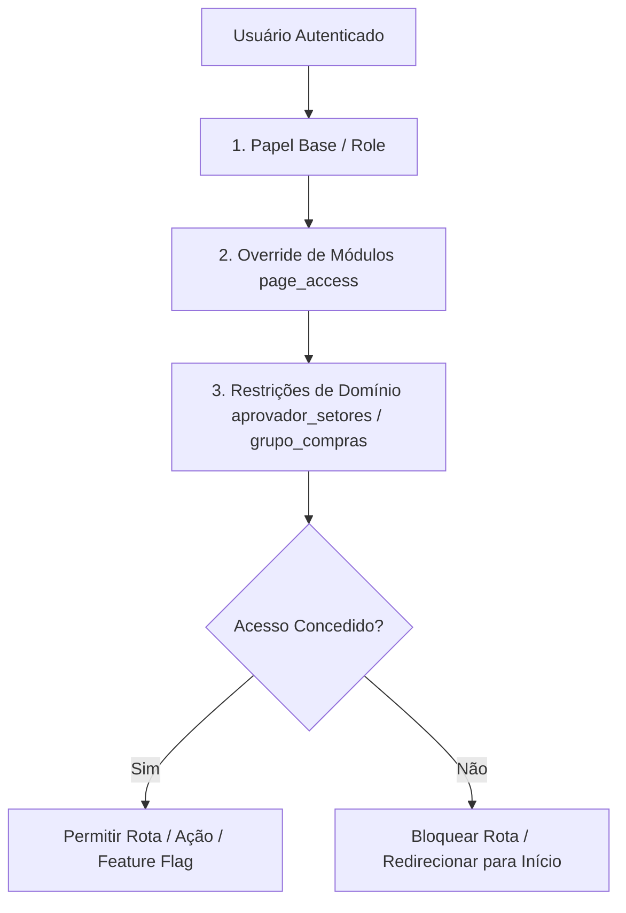

# Matriz de Controle de Acesso Baseado em Papéis (RBAC) — SISTEN

> **Sistema de Informação TEN (SISTEN)**  
> **Documento:** Matriz de Níveis de Acesso, Módulos e Permissões (RBAC)  
> **Versão:** 1.0.0  
> **Fonte da Verdade no Código:** `src/lib/pages.ts` & `src/types.ts`  
> **Última Atualização:** Agosto / 2026  

---

## 1. Visão Geral do Modelo de Segurança

O SISTEN utiliza uma arquitetura de segurança de 3 camadas para governar a autorização de usuários:



1. **Papéis Padrão (`Role`):** Perfis funcionais herdados na criação do usuário (`admin`, `coordenador_suprimentos`, `comprador`, `gestor`, `requisitante`, `solicitante`, `atendente`, `visualizador`, `pendente`).
2. **Overrides por Usuário (`page_access`):** O administrador pode conceder ou revogar o acesso a rotas específicas ou feature flags individualmente para cada usuário via painel `/admin/permissoes`.
3. **Mapeamento de Escopo e Alçada:**
   - `aprovador_setores`: Define exatamente quais setores da fábrica um gestor tem permissão para aprovar na tela de Aprovações.
   - `grupo_compras`: Código do grupo de compras SAP (ex: `314`, `358`, `447`, `575`) que atribui a responsabilidade de requisições a um comprador.
   - `aprovador_cadastro_sap`: Habilita notificações diretas de novos materiais ou fornecedores a serem cadastrados no SAP.

---

## 2. Descrição dos Papéis (Roles)

| Papel (`Role`) | Descrição e Atribuições Operacionais |
| :--- | :--- |
| **`admin`** | **Administrador Global.** Acesso irrestrito a todas as telas, configurações do sistema, gestão de usuários, importação de planilhas SAP e modo de simulação de perfis. |
| **`coordenador_suprimentos`** | **Coordenador de Suprimentos.** Acesso executivo e operacional a todos os módulos de compras, cadastros SAP, histórico, contratos, frete, dashboards e atribuição de compradores. |
| **`comprador`** | **Comprador Operacional.** Acesso à Central de Compras (sem PO), Painel SAP, Histórico com Auditoria IPCA, Rastreio de Compras, Fornecedores e Estimador de Frete. |
| **`gestor`** | **Gestor de Área / Aprovador.** Responsável por aprovar solicitações de compra enviadas pelos setores sob sua alçada (`aprovador_setores`). |
| **`requisitante`** | **Operador de Fila Coletiva.** Acompanha e responde solicitações de compra de múltiplos setores na fila coletiva (`/solicitacoes/todas`), além das próprias. |
| **`solicitante`** | **Usuário Padrão (Solicitante).** Pode abrir solicitações de compra, pedir cadastros no SAP, abrir chamados de Helpdesk e acompanhar a aba "Minhas Solicitações". |
| **`atendente`** | **Atendente de Suporte.** Operador do módulo de Helpdesk (TI, RH, Manutenção, Jurídico), responsável por assumir e resolver chamados. |
| **`visualizador`** | **Consultor Leitor.** Acesso somente-leitura a catálogos de materiais, relatórios básicos e rastreio sem exibição de valores financeiros. |
| **`pendente`** | **Aguardando Homologação.** Cadastro recém-criado sem acesso liberado às rotas internas até aprovação pelo administrador. |

---

## 3. Matriz Mestre de Níveis de Acesso a Páginas e Rotas

> **Legenda:**  
> - ✅ **Padrão (Liberado):** O papel tem acesso por padrão conforme registrado em `src/lib/pages.ts`.  
> - ⚙️ **Editável via Painel:** Acesso pode ser concedido ou revogado individualmente pelo Admin no painel de permissões (`page_access`).  
> - 🔒 **Administrativo Fixo (`alwaysAdmin`):** Restrito exclusivamente a `admin` (e `coordenador_suprimentos` quando aplicável). Não pode ser concedido a outros papéis via override.  
> - ❌ **Bloqueado:** Acesso negado por padrão.  

| Módulo / Grupo | Rota (`path`) | Chave (`id`) | `admin` | `coordenador` | `comprador` | `gestor` | `requisitante` | `solicitante` | `atendente` | `visualizador` | `pendente` |
| :--- | :--- | :--- | :---: | :---: | :---: | :---: | :---: | :---: | :---: | :---: | :---: |
| **GERAL** | `/` | `inicio` | ✅ | ✅ | ✅ | ✅ | ✅ | ✅ | ✅ | ✅ | ❌ |
| | `/materiais/busca` | `materiais_busca` | ✅ | ✅ | ✅ | ✅ | ✅ | ✅ | ✅ | ✅ | ❌ |
| | `/rastreio` | `rastreio` | ✅ | ✅ | ✅ | ✅ | ✅ | ✅ | ✅ | ✅ | ❌ |
| | `/relatorios` | `relatorios` | ✅ | ✅ | ✅ | ✅ | ✅ | ✅ | ✅ | ✅ | ❌ |
| | `/sobre` | `sobre` | ✅ | ✅ | ✅ | ✅ | ✅ | ✅ | ✅ | ✅ | ❌ |
| **SOLICITAÇÕES** | `/solicitacoes/nova` | `sol_nova` | ✅ | ✅ | ✅ | ✅ | ✅ | ✅ | ✅ | ⚙️ | ❌ |
| | `/solicitacoes/minhas` | `sol_minhas` | ✅ | ✅ | ✅ | ✅ | ✅ | ✅ | ✅ | ⚙️ | ❌ |
| | `/solicitacoes/todas` | `sol_todas` | ✅ | ✅ | ✅ | ✅ | ✅ | ⚙️ | ⚙️ | ❌ | ❌ |
| | `/solicitacoes/aprovacoes` | `sol_aprovacoes` | ✅ | ⚙️ | ⚙️ | ✅* | ⚙️ | ❌ | ❌ | ❌ | ❌ |
| **SUPRIMENTOS** | `/suprimentos/cadastros-sap` | `sup_cadastros_sap` | ✅ | ✅ | ✅ | ⚙️ | ⚙️ | ❌ | ❌ | ❌ | ❌ |
| | `/suprimentos/painel` | `sup_painel` | ✅ | ✅ | ✅ | ⚙️ | ⚙️ | ❌ | ❌ | ❌ | ❌ |
| | `/suprimentos/fornecedores` | `sup_fornecedores` | ✅ | ✅ | ✅ | ⚙️ | ⚙️ | ❌ | ❌ | ❌ | ❌ |
| | `/suprimentos/fornecedores-sem-po` | `sup_central_compras` | ✅ | ✅ | ✅ | ⚙️ | ⚙️ | ❌ | ❌ | ❌ | ❌ |
| | `/suprimentos/historico` | `sup_historico` | ✅ | ✅ | ✅ | ⚙️ | ⚙️ | ❌ | ❌ | ❌ | ❌ |
| | `/suprimentos/contratos` | `sup_contratos` | ✅ | ✅ | ✅ | ⚙️ | ⚙️ | ❌ | ❌ | ❌ | ❌ |
| | `/suprimentos/dashboards` | `sup_dashboards` | ✅ | ✅ | ⚙️ | ⚙️ | ⚙️ | ❌ | ❌ | ❌ | ❌ |
| | `/suprimentos/frete` | `sup_estimador_frete` | ✅ | ⚙️ | ✅ | ⚙️ | ⚙️ | ❌ | ❌ | ❌ | ❌ |
| | `/suprimentos/importar` | `sup_importar` | 🔒 | 🔒 | ❌ | ❌ | ❌ | ❌ | ❌ | ❌ | ❌ |
| **ALMOXARIFADO**| `/almoxarifado/estoque` | `almox_estoque` | ✅ | ✅ | ✅ | ⚙️ | ⚙️ | ❌ | ❌ | ❌ | ❌ |
| | `/almoxarifado/dashboards` | `almox_dashboards` | ✅ | ✅ | ✅ | ⚙️ | ⚙️ | ❌ | ❌ | ❌ | ❌ |
| **FINANCEIRO** | `/financeiro/contas-pagar` | `fin_contas_pagar` | ✅ | ⚙️ | ⚙️ | ⚙️ | ❌ | ❌ | ❌ | ❌ | ❌ |
| | `/financeiro/contas-pagar/analise` | `fin_contas_pagar_analise` | ✅ | ⚙️ | ⚙️ | ⚙️ | ❌ | ❌ | ❌ | ❌ | ❌ |
| **HELPDESK** | `/helpdesk` | `helpdesk_atendimento` | ✅ | ⚙️ | ⚙️ | ⚙️ | ⚙️ | ⚙️ | ✅ | ❌ | ❌ |
| | `/helpdesk/relatorios` | `helpdesk_relatorios` | ✅ | ⚙️ | ⚙️ | ⚙️ | ⚙️ | ⚙️ | ✅ | ❌ | ❌ |
| **ADMINISTRAÇÃO**| `/admin/uso` | `admin_uso` | 🔒 | ❌ | ❌ | ❌ | ❌ | ❌ | ❌ | ❌ | ❌ |
| | `/admin/usuarios` | `admin_usuarios` | 🔒 | 🔒 | ❌ | ❌ | ❌ | ❌ | ❌ | ❌ | ❌ |
| | `/admin/setores` | `admin_setores` | 🔒 | 🔒 | ❌ | ❌ | ❌ | ❌ | ❌ | ❌ | ❌ |
| | `/admin/permissoes` | `admin_permissoes` | 🔒 | 🔒 | ❌ | ❌ | ❌ | ❌ | ❌ | ❌ | ❌ |
| | `/admin/importacao-materiais` | `admin_importacao_materiais` | 🔒 | 🔒 | ❌ | ❌ | ❌ | ❌ | ❌ | ❌ | ❌ |
| | `/admin/importar/log` | `admin_importar_sap_log` | 🔒 | 🔒 | ❌ | ❌ | ❌ | ❌ | ❌ | ❌ | ❌ |
| | `/suprimentos/grupos-comprador` | `admin_grupos_comprador` | 🔒 | 🔒 | ❌ | ❌ | ❌ | ❌ | ❌ | ❌ | ❌ |
| | `/admin/helpdesk` | `admin_helpdesk_config` | 🔒 | 🔒 | ❌ | ❌ | ❌ | ❌ | ❌ | ❌ | ❌ |
| | `/admin/teste` | `admin_teste` | 🔒 | ❌ | ❌ | ❌ | ❌ | ❌ | ❌ | ❌ | ❌ |

*\*Nota: Na tela `/solicitacoes/aprovacoes`, o papel `gestor` visualiza apenas as solicitações pertencentes aos setores cadastrados em seu `aprovador_setores`.*

---

## 4. Matriz de Feature Flags e Sub-Permissões Dinâmicas

Feature flags são sub-permissões sem rota própria que habilitam capacidades específicas na interface ou notificam determinados perfis.

| Sub-Permissão / Feature Flag | Chave (`id`) | Descrição | `admin` | `coordenador` | `comprador` | `gestor` | Outros Perfis |
| :--- | :--- | :--- | :---: | :---: | :---: | :---: | :---: |
| **Ver valores de compra (Rastreio Compras)** | `rastreio_valores` | Exibe os montantes financeiros (R$ valor total e preço unitário) nos cards e timeline de Rastreio Compras. | ✅ | ✅ | ✅ | ✅ | ⚙️ (Requisitante / Solicitante) |
| **Chamados Jurídicos (Notificações)** | `juridico_notificar` | Define se o usuário recebe alertas de novos chamados direcionados ao setor Jurídico. | ⚙️ | ⚙️ | ⚙️ | ⚙️ | Atribuído individualmente via Admin |

---

## 5. Matriz de Capacidades Operacionais e Ações por Módulo

```mermaid
matrix
    title Matriz de Ações Operacionais vs Papéis Principais
```

| Ação Operacional / Capacidade | `admin` | `coordenador` | `comprador` | `gestor` | `solicitante` | `atendente` |
| :--- | :---: | :---: | :---: | :---: | :---: | :---: |
| **Criar Solicitação de Compra / Rascunho** | ✅ | ✅ | ✅ | ✅ | ✅ | ✅ |
| **Aprovar / Rejeitar Solicitação de Compra** | ✅ | ✅ | ❌ | ✅ (do seu setor) | ❌ | ❌ |
| **Vincular RI / PO do SAP e alterar status** | ✅ | ✅ | ✅ | ❌ | ❌ | ❌ |
| **Registrar Cotações na Central de Compras** | ✅ | ✅ | ✅ | ❌ | ❌ | ❌ |
| **Atestar / Concluir Cadastro SAP (Material/Forn)** | ✅ | ✅ | ✅ | ❌ | ❌ | ❌ |
| **Assumir / Responder Chamado de Helpdesk** | ✅ | ⚙️ | ⚙️ | ⚙️ | ❌ | ✅ |
| **Avaliar Chamado Resolvido (CSAT 1-5)** | ✅ | ✅ | ✅ | ✅ | ✅ (próprio) | ❌ |
| **Editar Detalhes de Contrato (Gestor/Parcela)** | ✅ | ✅ | ✅ | ❌ | ❌ | ❌ |
| **Importar Planilhas Excel do SAP (ME5A/ZL0132)** | ✅ | ✅ | ❌ | ❌ | ❌ | ❌ |
| **Simular Perfil de Outro Usuário (Role Sim)** | ✅ | ❌ | ❌ | ❌ | ❌ | ❌ |
| **Alterar Roles e Permissões de Usuários** | ✅ | ✅ | ❌ | ❌ | ❌ | ❌ |

---

## 6. Algoritmo de Validação no Código (`canAccessPage`)

A verificação de acesso em tempo de execução no frontend é unificada pela função `canAccessPage` (`src/lib/pages.ts`), garantindo consistência entre a barra lateral (`Sidebar.tsx`), o roteador (`App.tsx`) e o painel administrativo (`AdminPanel.tsx`):

```typescript
export function canAccessPage(user: Profile, pageId: string): boolean {
  // 1. Admin possui bypass universal
  if (user.roles.includes('admin')) return true;

  const def = BY_ID[pageId];
  if (!def) return false;

  // 2. Override explícito no perfil do usuário (se não for rota estritamente administrativa)
  const override = user.page_access?.[pageId];
  if (override !== undefined && !def.alwaysAdmin) return override;

  // 3. Permissão universal de página ('*')
  if (def.defaultRoles === '*') return true;

  // 4. Verificação de pertencimento aos papéis padrão
  return def.defaultRoles.some(r => user.roles.includes(r));
}
```

---

## 7. Políticas de Segurança em Banco de Dados (Supabase RLS)

No nível de persistência (Postgres 17), os acessos são reforçados através de **Row Level Security (RLS)**:

* **Tabela `requests`:** Solicitantes possuem permissão de `SELECT` e `UPDATE` apenas em registros onde `solicitante_id = auth.uid()`. Gestores possuem acesso aos registros onde `solicitante_sector_id` está presente em seu array `aprovador_setores`.
* **Tabela `profiles`:** Leitura pública para usuários autenticados (`status = 'ativo'`). Alteração de papéis e `page_access` restrita aos administradores via trigger/function com checagem de role `admin`.
* **Buckets do Storage:** Upload de anexos vinculado à solicitação ativa; download restrito aos usuários com permissão de visualização na solicitação correspondente.
