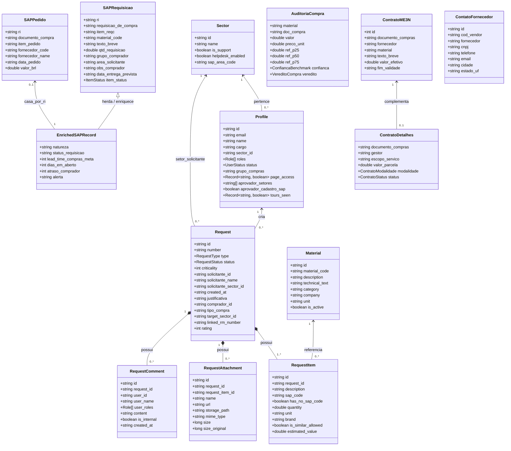
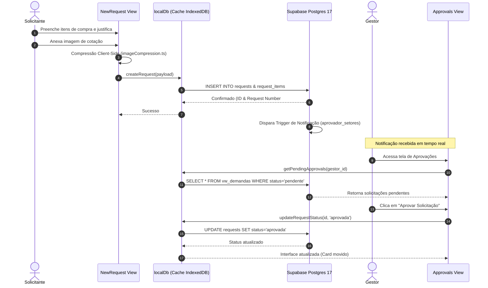
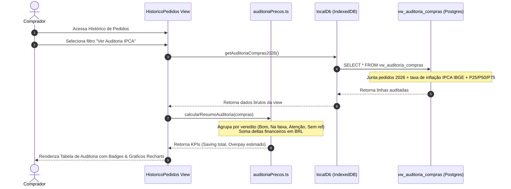
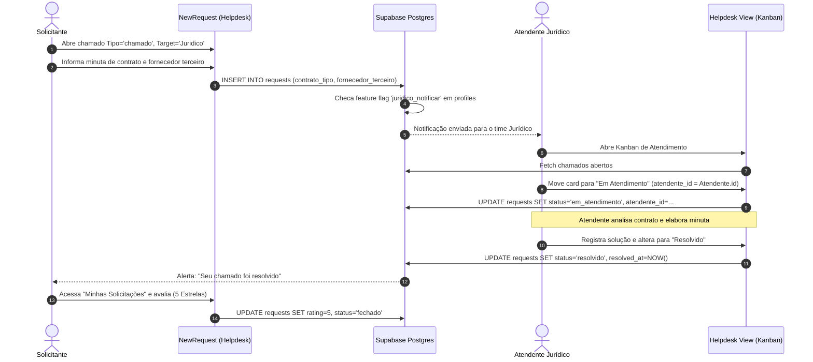
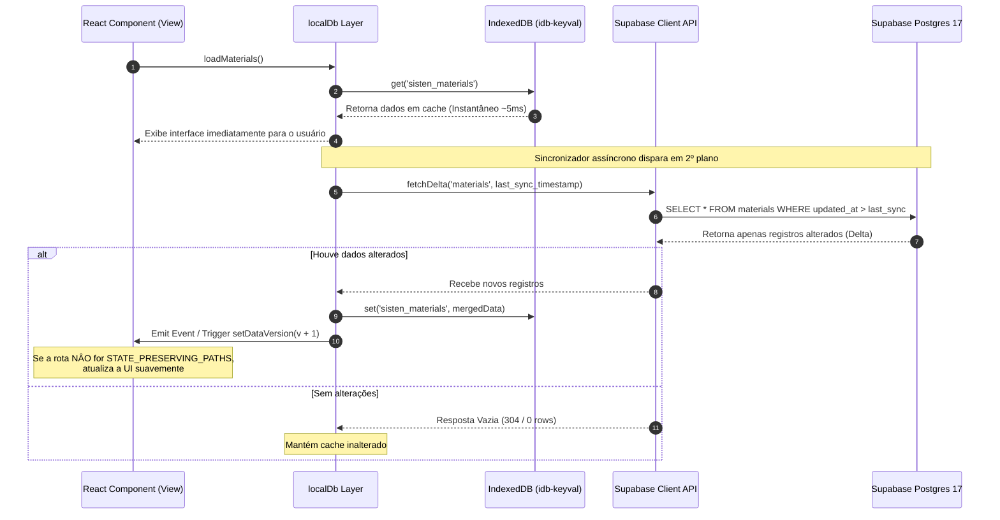
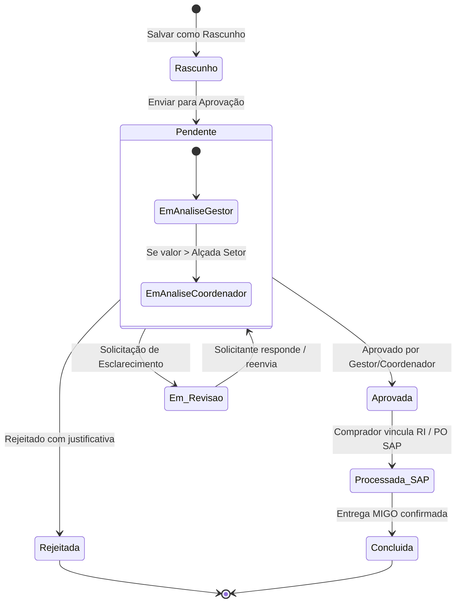
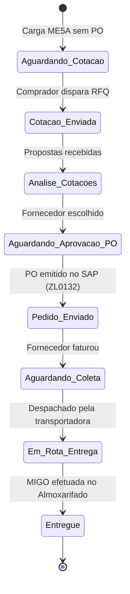

# Especificação UML — Sistema de Informação TEN (SISTEN)

> **Documentação de Diagramas UML (Unified Modeling Language)**  
> **Projeto:** SISTEN — Sistema de Informação TEN S.A.  
> **Versão:** 1.0.0  
> **Data:** Agosto / 2026  

---

## 1. Visão Geral

Este documento apresenta a modelagem de software baseada em **UML (Unified Modeling Language)** do sistema SISTEN. Ele cobre os diagramas estruturais (Classes e Componentes/Pacotes) e diagramas comportamentais (Sequências e Máquinas de Estado) que governam o ecossistema da aplicação.

---

## 2. Diagrama de Arquitetura e Pacotes UML

O diagrama de pacotes ilustra a organização em camadas do sistema, com separação clara entre a camada de apresentação, regras de negócio puras, persitência/cache local e banco de dados em nuvem.

```mermaid
package "SISTEN System" {

    package "Presentation Layer (React 19 Views)" {
        [App Router (Hash)]
        [Views: Requests & Approvals]
        [Views: Suprimentos & Painel SAP]
        [Views: Histórico & Auditoria IPCA]
        [Views: Almoxarifado & Financeiro]
        [Views: Helpdesk & Admin]
    }

    package "Business Logic Layer (src/lib)" {
        [auditoriaPrecos.ts]
        [suprimentos.ts]
        [rastreio.ts]
        [fbl1n.ts]
        [almoxarifado.ts]
        [pages.ts (RBAC & Feature Flags)]
        [imageCompression.ts]
    }

    package "Data Access & Cache Layer (src/db)" {
        [localDb.ts (Data Service)]
        [IndexedDB Cache (idb-keyval)]
        [Background Sync Engine]
    }

    package "Backend Persistence (Supabase Cloud)" {
        [Supabase Postgres 17 DB]
        [Supabase Auth (JWT)]
        [Supabase Storage Buckets]
        [Edge Functions (Deno)]
    }
}

[Presentation Layer (React 19 Views)] --> [Business Logic Layer (src/lib)]
[Presentation Layer (React 19 Views)] --> [Data Access & Cache Layer (src/db)]
[Data Access & Cache Layer (src/db)] --> [IndexedDB Cache (idb-keyval)]
[Data Access & Cache Layer (src/db)] <--> [Backend Persistence (Supabase Cloud)]
```

---

## 3. Diagrama de Classes UML (Class Diagram)

O diagrama de classes reflete o modelo de domínio do SISTEN (conforme definido em `src/types.ts` e no schema relacional Postgres).



---

## 4. Diagramas de Sequência UML (Sequence Diagrams)

### 4.1 Sequência 1: Criação e Aprovação de Solicitação de Compra

Este diagrama detalha a interações entre o Solicitante, a interface React, a camada de dados localDb, o Supabase e o perfil Gestor durante o envio e aprovação de uma requisição.



---

### 4.2 Sequência 2: Auditoria de Preços de Compras (2026 vs Histórico IPCA)

Demonstra a execução da auditoria de compras de 2026 calculada contra a mediana dos preços históricos corrigidos monetariamente.



---

### 4.3 Sequência 3: Atendimento e Conclusão de Chamado de Helpdesk (com Ticket Jurídico)

Mostra o fluxo de vida de um chamado de Helpdesk direcionado ao setor Jurídico ou Suporte Operacional.



---

### 4.4 Sequência 4: Sincronização Incremental Offline-First (Background Sync Engine)

Explicita o funcionamento da camada de resiliência e persistência local offline/online do SISTEN (`localDb.ts`).



---

## 5. Diagramas de Estados UML (State Machine Diagrams)

### 5.1 Máquina de Estados: Solicitação de Compra (`RequestStatus`)



---

### 5.2 Máquina de Estados: Item de Requisição no SAP (`ItemStatus`)



---

## 6. Conclusão e Rastreadores de Manutenção

Este documento UML reflete a arquitetura real do repositório `sisten`. Quaisquer alterações estruturais nos arquivos de domínio (`src/types.ts`), rotas (`src/lib/pages.ts`) ou esquema de banco de dados (`db/sql/`) devem ser refletidas nesta especificação para manter a documentação viva e sincronizada com o código em produção.
